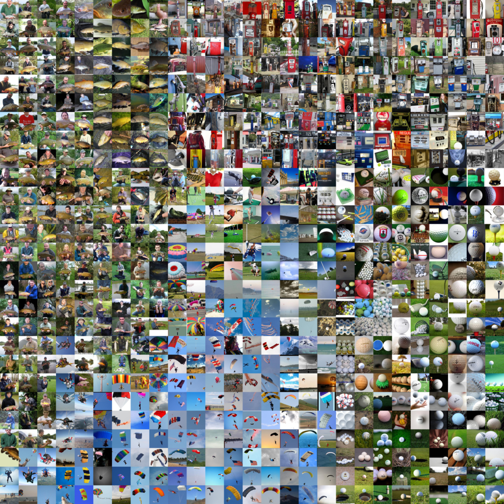

Sjaandi [](https://circleci.com/gh/pechyonkin/sjaandi/tree/master) [](https://coveralls.io/github/pechyonkin/sjaandi?branch=master) [](https://pypi.org/project/sjaandi/)  [](https://github.com/pechyonkin/sjaandi/blob/master/LICENSE)
==============================

Use your images to create collages based on visual similarity, where similar images are located close to each other, like in the example below:



**Note:** This work was inspired by Andrej Karpathy's [visualizations](https://cs.stanford.edu/people/karpathy/cnnembed/) of ImageNet dataset.

## 1. Installation

Sjaandi is [available](https://pypi.org/project/sjaandi/) for installation using pip:

```pip install sjaandi```

## 2. Using the Library

All you need is to have all images for collage in one folder, and use that path as input to `VisualSearchEngine()`:

```python
from sjaandi import VisualSearchEngine

DATA_PATH = # path to the folder with images

collage = VisualSearchEngine(DATA_PATH).make_collage()
```

The collage will be a square, two-dimensional grid of square images. If the number of pictures in your folder is not a square of some number, some photos will not end up in the collage. For example, if you provide 50 images, you will get a 7-by-7 collage having 49 images, which means 1 of the pictures of the 50 will not be included.


## 3. Technical Details

Underneath the hood, this library puts your images through a neural network and collects high dimensional activations. The activations are mapped to a two-dimensional Cartesional space using the t-SNE algorithm. The next step is to transform the t-SNE coordinates into a square lattice of coordinates. Finally, your images are laid out at lattice coordinates to produce the final image.


### Main Dependencies:

- python 3.6
- [fastai](https://docs.fast.ai/)
- [pytorch](https://pytorch.org/)
- [scikit-learn](https://scikit-learn.org/)
- [rasterfairy-py3](https://github.com/pechyonkin/RasterFairy-Py3)
